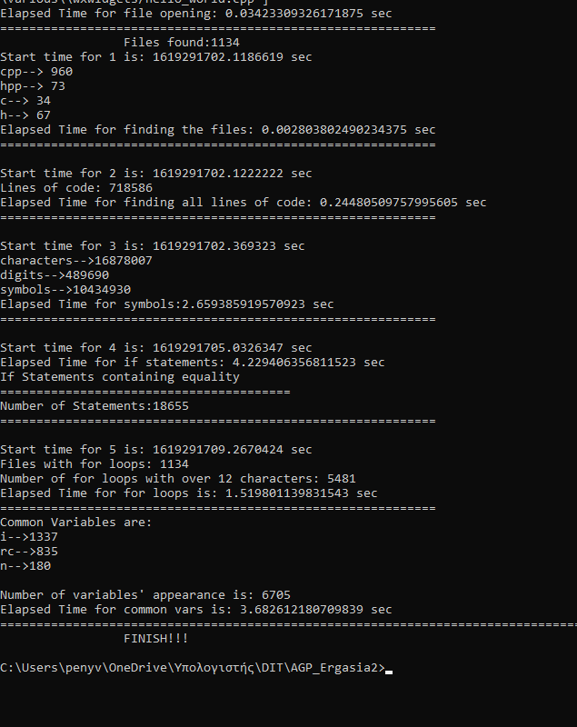

# **Assignment 2_DIT_AGP**

## Στοιχεία:

<ul><li> Βίννη Παναγιώτα </li>
    <li> A.M. : 1873 </li>
    <li> penyvinni@gmail.com </li>
    <li> 24/4/2021 </li> </ul> 

## Περιγραφή Εργασίας

 Η συγκεκριμένη εργασία, μέσω ενός φακέλου με διάφορα αρχεία, μπορεί και βρίσκει τον αριθμό συγκεκριμένων αρχείων ( με κατάληξη .c,.h,.cpp,.hpp), μετράει όλες τις γραμμές κώδικα, καθώς και όλα τα σύμβολα/ψηφία/χαρακτήρες, βρίσκει συγεκριμένα if και for loops, ενώ τέλος εμφανίζει και τα 3 κοινά ονόματα μεταβλητών για όλες τις ακέραιες μεταβλητές. 

## Αποτελέσματα Κώδικα

<ol> 
<li> Πλήθος αρχείων: <ul><li>c: 34 αρχεία</li><li>h: 67 αρχεία</li><li>cpp: 960 αρχεία</li><li>hpp: 73 αρχεία</li></ul></li>
<li> Συνολικό πλήθος γραμμών κώδικα: 718.586 </li>
<li> Πλήθος συμβόλων από όλα τα αρχεία: <ul><li>Χαρακτήρες: 16.878.007</li><li>Ψηφία: 489.690</li><li> Σύμβολα: 10.434.930</li></ul></li>
<li> Πλήθος των εντολών if με συνθήκη ισότητας: 18.655 </li>
<li> Πλήθος εντολών for που το περιεχόμενο μέσα στις παρενθέσεις είναι μεγαλύτερο από 12 χαρακτήρες, χωρίς να λαμβάνονται υπόψη τυχόν κενά: 5.481 (Τα αρχεία με τις εντολές: 1.134)</li>
<li> Πλήθος εμφανίσεών των 3 κοινών ονομάτων μεταβλητών για όλες τις ακέραιες μεταβλητές σε οποιοδήποτε σημείο: 6.705 
  <ul><li>i: 1337</li><li>rc: 835</li><li>n: 180</li> </ul> </li>
</ol>
 

## Χρόνοι εκτέλεσης κάθε ερωτήματος

<ol> 
<li> 0.002803802490234375 sec </li>
<li> 0.24480509757995605 sec </li>
<li> 2.659385919570923 sec </li>
<li> 4.229406356811523 sec</li>
<li> 1.519801139831543 sec </li>
<li> 3.682612180709839 sec </li>
</ol>

## Εκτέλεση Κώδικα

- python ergasia2.py
